# 🧪 Results

This document presents the experimental outcomes of the reproduced research work on two datasets — **UNSW-NB15 (original dataset)** and **IoT-23 (extended dataset)**.  
It includes confusion matrices, ROC curves, multiclass visualizations, and terminal outputs illustrating model performance.

---

## 📘 Dataset 1: UNSW-NB15 (Original)

### **1. Binary Classification Results**

#### 🔹 Confusion Matrices
| Model | Confusion Matrix |
|--------|------------------|
| Decision Tree | 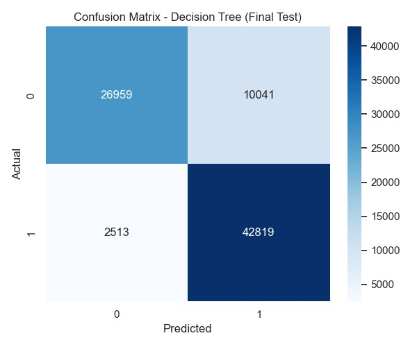 |
| Random Forest | 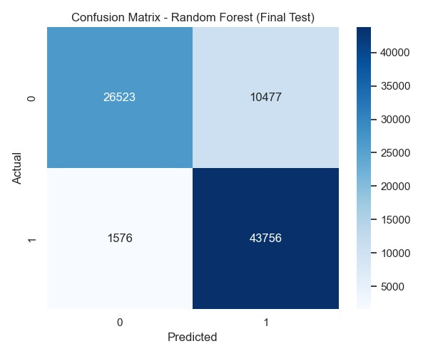 |
| Extra Trees | 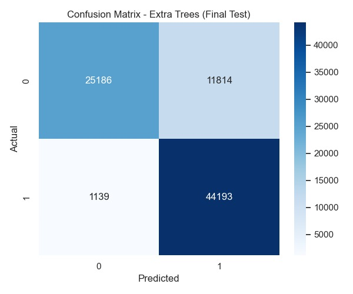 |
| XGBoost | 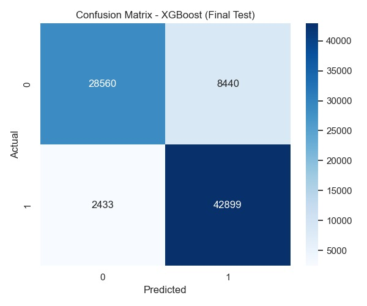 |

#### 🔹 ROC Curves
| Model | ROC Curve |
|--------|------------|
| Decision Tree | 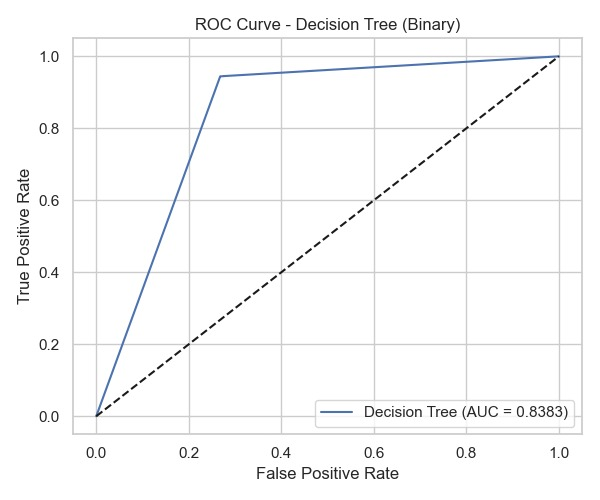 |
| Random Forest |  |
| Extra Trees |  |
| XGBoost |  |

#### 🔹 Terminal Outputs
- 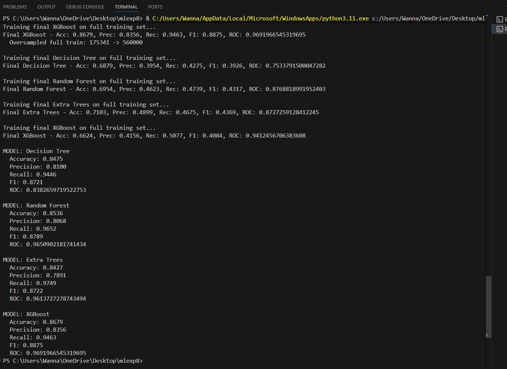  
- 

---

### **2. Multiclass Classification Results**

#### 🔹 Confusion Matrices
| Model | Confusion Matrix |
|--------|------------------|
| Decision Tree | 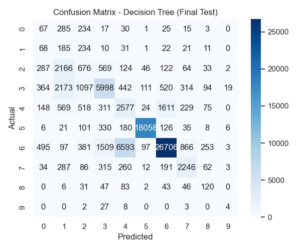 |
| Extra Trees | 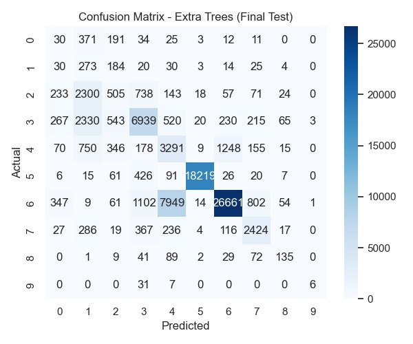 |
| XGBoost | 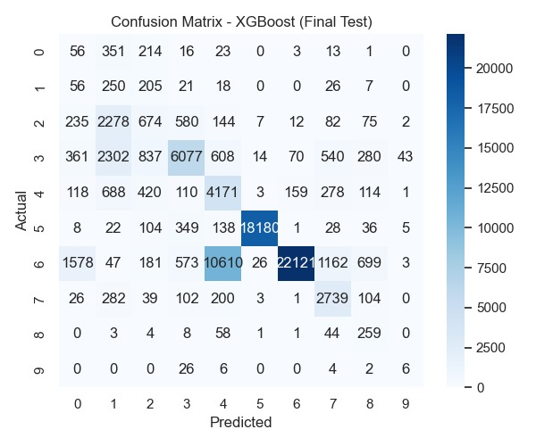 |

---

## 🌐 Dataset 2: IoT-23 (Extended)

### **1. Binary Classification Results**

#### 🔹 Confusion Matrices
| Model | Confusion Matrix |
|--------|------------------|
| Decision Tree |  |
| Random Forest | 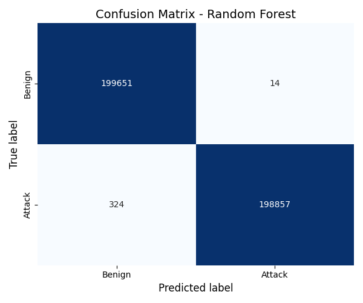 |
| Extra Trees | 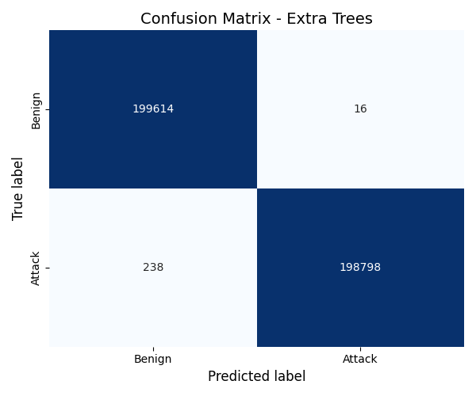 |
| XGBoost | 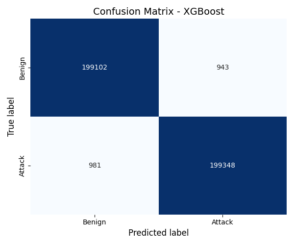 |

#### 🔹 ROC Curves
| Model | ROC Curve |
|--------|------------|
| Decision Tree | 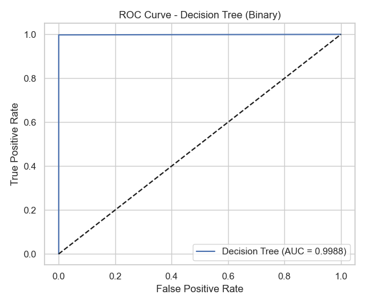 |
| Random Forest | 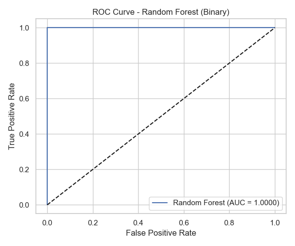 |
| Extra Trees | 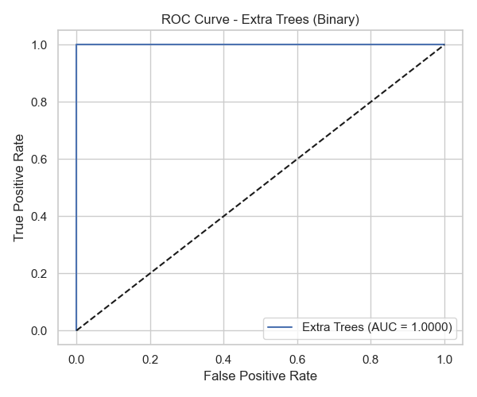 |
| XGBoost | 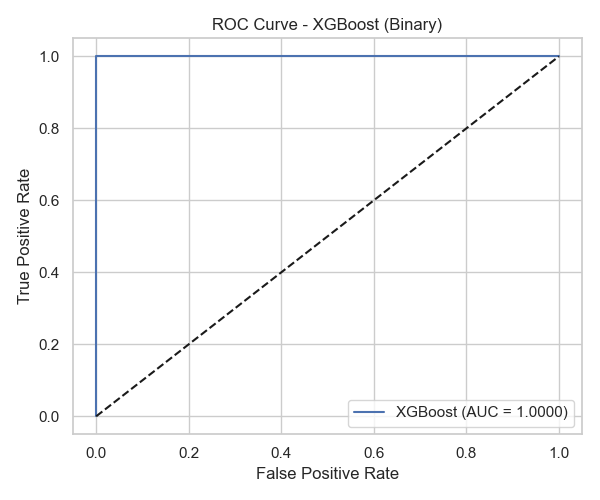 |

#### 🔹 Terminal Output
- 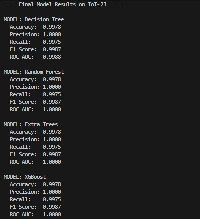

---

## 📊 Summary of Findings

- **Random Forest** and **XGBoost** consistently delivered the best results in both binary and multiclass experiments.  
- **Stacking Feature Embedding (SFE)** significantly enhanced detection accuracy by introducing meta-features derived from clustering.  
- The **IoT-23 dataset** demonstrated the generalizability of the proposed pipeline for intrusion detection in IoT environments.  
- The visual results validate the robustness and scalability of the reproduced research workflow.

---
